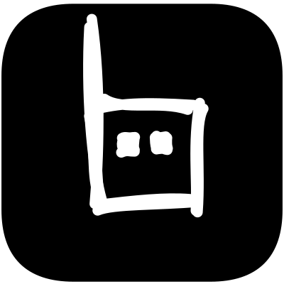

  <a href="https://github.com/cheatsnake/botyard">
    
    <h1 align="center">Botyard</h1>
  </a>

[Botyard](https://github.com/cheatsnake/botyard) is a self-hosted platform that offers a comprehensive solution for the development, management, and interaction with chatbots. It provides a preconfigured backend server equipped with a user-friendly HTTP API, enabling easy platform management and chatbot development in any programming language. Additionally, it features a streamlined web client application designed for seamless interaction with pre-built bots.
