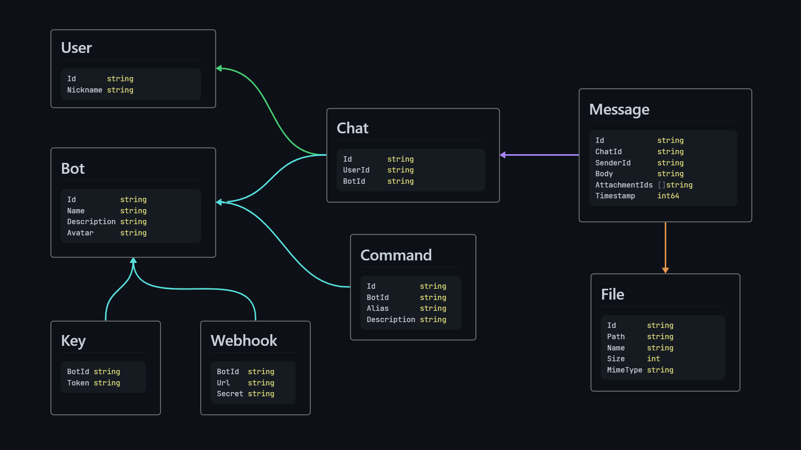

# Intro

[Botyard](https://github.com/cheatsnake/botyard) is a self-hosted platform that offers a comprehensive solution for the development, management, and interaction with chatbots.

It provides a preconfigured backend server equipped with a user-friendly HTTP API, enabling easy platform management and chatbot development in any programming language.

Additionally, it features a streamlined web client application designed for seamless interaction with pre-built bots.

## Project architecture

Botyard architecture is pretty staightforward. It all revolves around only three main components: **bots**, **users** and **chats**.

**User** are the simplest of them all. This component is only responsible for user indetification in the system. It is so minimalistic that it contains only an identifier and a nickname.

**Bot** is the most advanced component. Each **bot** is a small independent system, which implies the ability to handle **messages** from multiple **users**. **Commands** can be added to the bot, which can be used to describe its functionality as simply and concisely as possible. Since each **bot** can be developed and managed independently, each bot has an access **key** for this purpose. Finally, for efficient and fast processing of user **messages**, a [**webhook**](https://en.wikipedia.org/wiki/Webhook) can be attached to each **bot**.

**Chat** is the connecting link between the **user** and the **bot**. **Chats** contain **messages** that can be sent by both the **user** and the **bot**. Each **message** contains a body (text information). Additionally, you can attach **files** to each **message**.

## What is it good for?

Botyard is perfect as a transport layer for delivering data from server applications to end users. Thanks to this, you can save resources and not develop the [UI](https://en.wikipedia.org/wiki/User_interface) (frontend) part of your application separately.

For example, if you are developing applications based on artificial intelligence, in particular on [Large Language Models (LLM)](https://en.wikipedia.org/wiki/Large_language_model), then interacting with them through bots is an extremely successful combination, which has already shown its power on the example of [ChatGPT](https://en.wikipedia.org/wiki/ChatGPT).

If you are developing [CLI](https://en.wikipedia.org/wiki/Command-line_interface) applications, then this will also allow you to expand the potential of your applications by expanding their scope of use.

## What does it feel like?

The concept of bots is not new and is used in many other systems. For example, [Telegram](<https://en.wikipedia.org/wiki/Telegram_(software)>) messenger has a whole [API for bots](<https://en.wikipedia.org/wiki/Telegram_(software)#Bots>). Or, the popular platform for voice and video calls [Discord](https://en.wikipedia.org/wiki/Discord) also has an advanced [chatbot system](https://en.wikipedia.org/wiki/Discord#Developer_tools_and_bots).

Of course, it is not correct to say that Botyard can be a direct competitor among such giants, to put it mildly. Rather, it is an alternative that is much simpler and completely controlled by you.

## What are the main benefits?

-   **Simplicity**. No matter how much it has already been mentioned, but it really is.
-   **Fast and lightweight**. The main part of the platform is written in Go - a fast, compiled and minimalistic programming language. The final binary file of the server weighs about 17 MB. And the initial start-up of the server allocates only about 1.2 MB of RAM.
-   **Open source**. You can view the source code, offer your corrections and suggestions. Together we can make it better.
